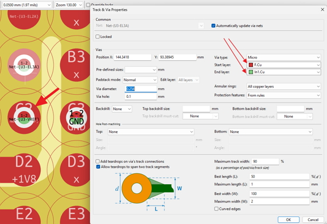
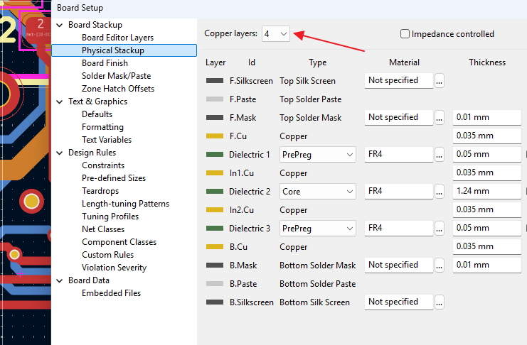
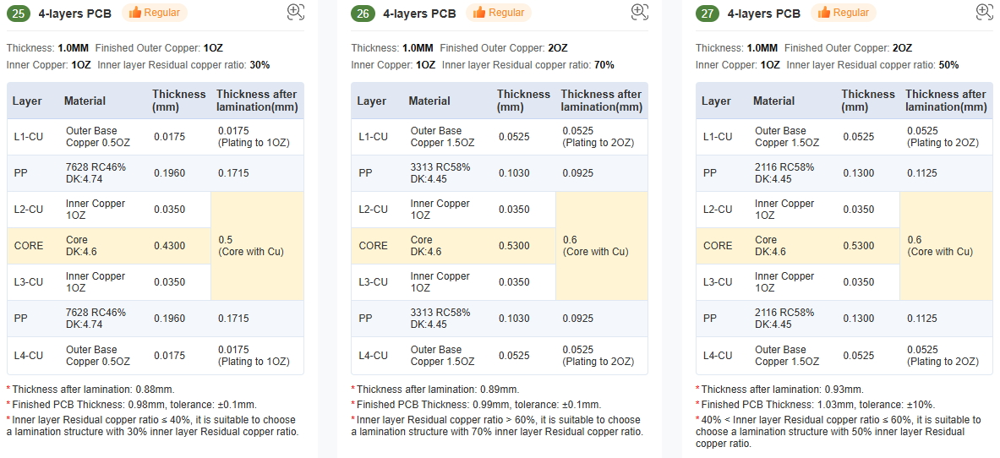
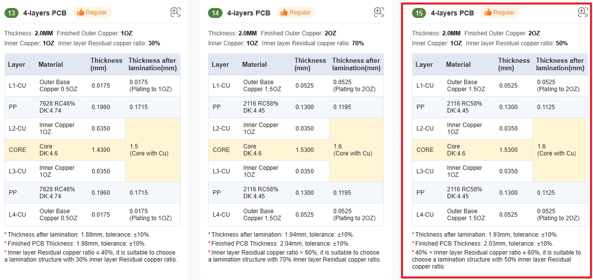
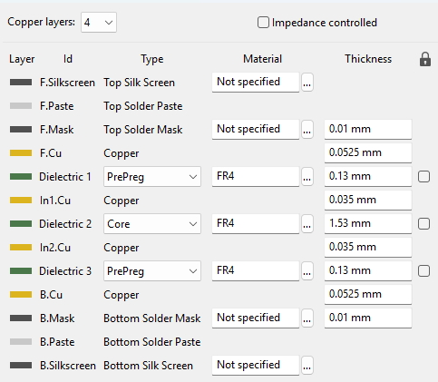
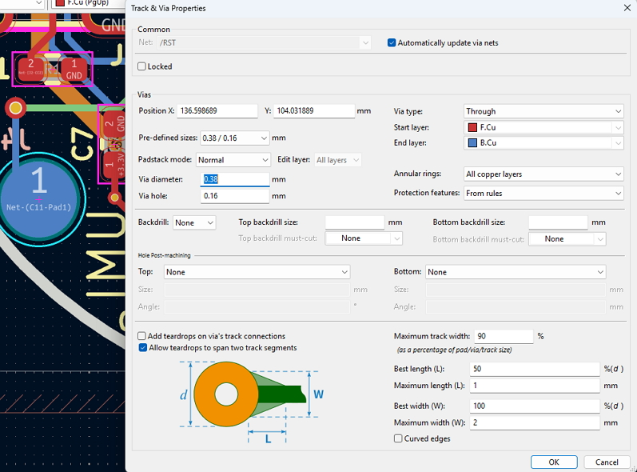
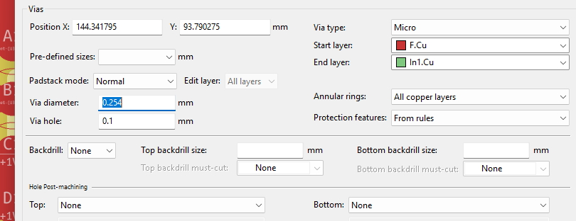

# Microvias
There are different types of Microvias. Right now we are dealing with via-in-pad and buried via. Which is we may need to add via-in-pad with buried features. 

# PCBWAY Manufacturer Capability
As per PCBWAY capability according to HDI PCB spec they mentioned  

1. Min Tracing Spacing : 2.5mil/2.5mil : 0.0635mm
2. Min Annular Ring : 4mil / 0.1016mm, 3mil / 0.0762mm - laser drill
3. Min Drilling Hole Diameter : 6mil / 0.1524mm, 4mil / 0.1016mm - laser drill
4. Max Exponents of Blind/Buried Vias : stacked vias for 3 layers interconnected, staggered vias for 4 layers interconnected 

According to Gemini 3 Pro :  
1 Mil = 0.0254 mm  

total Via Diameter = Drill Hole + (2 × Annular Ring)  
Diameter in mils: 4 mil + (2 × 3 mil) = 10 mil  
Diameter in mm: 10 mil × 0.0254 = 0.254 mm  

### Recommended Microvia Settings:
Microvia Hole (Drill): 0.1 mm (or 0.1016 mm)  
Microvia Diameter (Pad): 0.254 mm  

# Microvia Layers
Microvai should be placed to pass connections between Prep layers, Not Thicker 
Layers. So while using 4 layers, Use Microvia first from F.Cu to In1.Cu Layer, 
Then trace out to free space then use a Normal via to route to other places.  

During drawing a trace, Place a Micro Via with Ctrl + v key, after placing and routing, double click the via and select the start layer and destination layer.  
 

## PCB Stack
 
This Stackup is not correct. The PrePreg thickness is too small.   
PCBWAY Stack Page:  
[PCBWAY Stackup multi-layer-laminated-structure](https://www.pcbway.com/multi-layer-laminated-structure.html)  

Industry standard PrePregs are: 
1. 1080: 0.080mm to 0.086mm 3.15mil to 3.4mil
2. 2116: 0.109mm to 0.115mm 4.3mil to 4.53mil
3. 7628: 0.185mm to 0.196mm 7.28mil to 7.7mil
### Corrected Stack

# Articles from PCB WAY
[3 Keys to Designing a Successful HDI PCB](https://www.pcbcart.com/article/content/design-successful-HDI-PCBs.html?_gl=1*lno35d*_up*MQ..*_gs*MQ..&gclid=CjwKCAjwuO_QBhAWEiwAIkVhU8_oNcV2V0Zg12P9zLzK98u00i-ylJH_qnmzmY52dYom6B5MM8KJwhoCs3kQAvD_BwE&gbraid=0AAAAAC-0nPoTU3apj1_PP06kbtWepD3xG)

## Sub Article Title **Aperture**
Here Aperture is the diameter of drilled hole. Laser hole diameter depends on the Thickness of the Prepreg. The thicker the board is, the smaller the aperture is.

## Smallest Via Diameter and Hole for PCBWAY (Not Microvia)

## Microvia Diameter and Hole for PCBWAY

