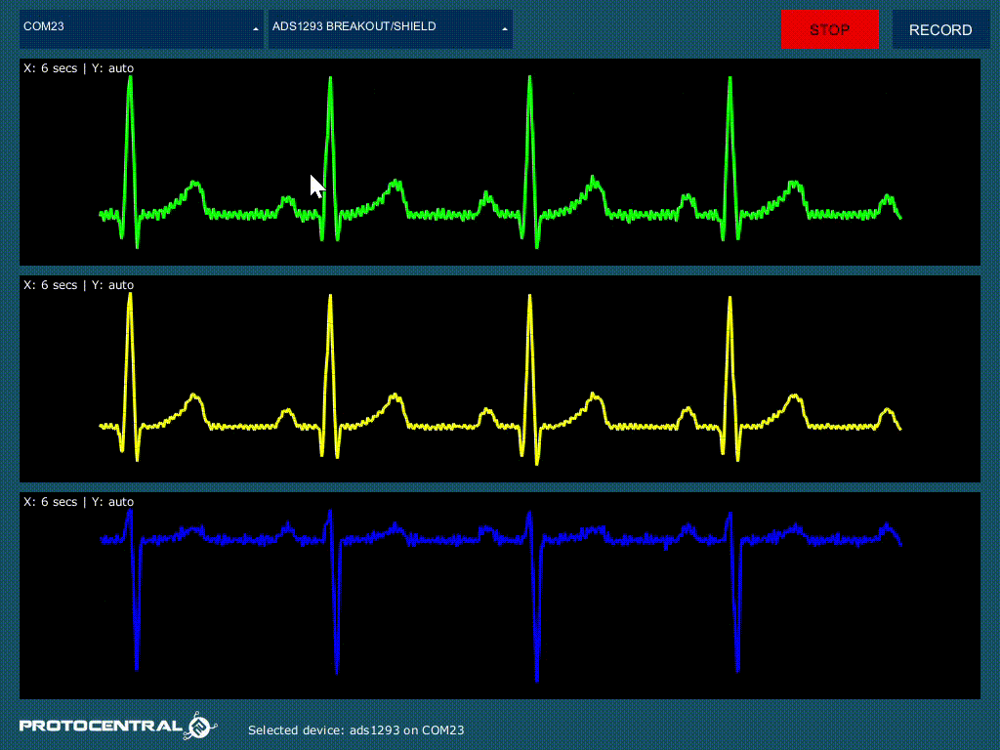
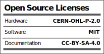

# Protocentral ADS1293 Arduino Library

[](https://github.com/Protocentral/protocentral-ads1293-arduino/actions?workflow=Compile+Examples)

Arduino library for the Protocentral ADS1293 3-channel, 24-bit ECG breakout board.

## Don't have one? [Buy it here](https://protocentral.com/product/protocentral-ads1293-breakout-board/)


The ADS1293 is a low-power, 3-channel, 24-bit analog front-end for biopotential measurements, ideal for ECG applications. It features independently programmable channels, flexible input multiplexing, Right Leg Drive (RLD), Wilson Central Terminal (WCT) for precordial leads, and lead-off detection.

## Features

- 3 high-resolution 24-bit sigma-delta ADC channels
- Configurable sampling rates (32 to 853 SPS)
- Support for 3-lead and 5-lead ECG configurations
- Built-in Right Leg Drive (RLD) amplifier
- Wilson Central Terminal for precordial lead measurements
- SPI interface

## Installation

### Arduino Library Manager (Recommended)
1. Open Arduino IDE
2. Go to **Sketch → Include Library → Manage Libraries**
3. Search for "Protocentral ADS1293"
4. Click **Install**

### Manual Installation
1. Download or clone this repository
2. Copy to your Arduino libraries folder (`~/Documents/Arduino/libraries/`)

## Hardware Setup

### Pin Connections

| Signal | Arduino UNO | ESP32 (VSPI) |
|--------|-------------|--------------|
| MISO   | 12          | 19           |
| MOSI   | 11          | 23           |
| SCLK   | 13          | 18           |
| CS     | 4           | 4            |
| DRDY   | 2           | 2            |
| VCC    | 5V          | 5V           |
| GND    | GND         | GND          |

### ECG Electrode Input Mapping

The ADS1293 has 6 input pins (IN1-IN6) that connect to ECG electrodes:

| Input | Electrode | Description |
|-------|-----------|-------------|
| IN1   | RA        | Right Arm   |
| IN2   | LA        | Left Arm    |
| IN3   | LL        | Left Leg    |
| IN4   | RL        | Right Leg (RLD driven) |
| IN5   | V1        | Precordial lead (5-lead only) |
| IN6   | WCT       | Wilson Central Terminal reference |

### Lead Configuration

**3-Lead ECG (Einthoven's Triangle):**
- Channel 1: Lead I = LA - RA (IN2 - IN1)
- Channel 2: Lead II = LL - RA (IN3 - IN1)
- Lead III is calculated: Lead III = Lead II - Lead I

**5-Lead ECG (adds precordial lead):**
- Channel 1: Lead I = LA - RA
- Channel 2: Lead II = LL - RA
- Channel 3: V1 = IN5 - WCT (Wilson Central Terminal)

## Quick Start

### 3-Lead ECG Example

```cpp
#include "protocentral_ads1293.h"
#include <SPI.h>

#define DRDY_PIN 2
#define CS_PIN 4

ADS1293 ecg(DRDY_PIN, CS_PIN);

void setup() {
    Serial.begin(115200);
    ecg.begin();

    // Configure for 3-lead ECG
    ecg.configureChannel1(FlexCh1Mode::Default);  // Lead I: LA-RA
    ecg.configureChannel2(FlexCh2Mode::Default);  // Lead II: LL-RA
    ecg.enableCommonModeDetection(CMDetMode::Enabled);
    ecg.configureRLD(RLDMode::Default);
    ecg.configureOscillator(OscMode::Default);
    ecg.configureAFEShutdown(AFEShutdownMode::AllEnabled);
    ecg.setSamplingRate(ADS1293::SamplingRate::SPS_128);
    ecg.configureDRDYSource(DRDYSource::Default);
    ecg.configureChannelConfig(ChannelConfig::Default3Lead);
    ecg.applyGlobalConfig(GlobalConfig::Start);
}

void loop() {
    if (ecg.isDataReady()) {
        auto samples = ecg.getECGData();
        if (samples.ok) {
            Serial.print(samples.ch1);
            Serial.print(',');
            Serial.print(samples.ch2);
            Serial.print(',');
            Serial.println(samples.ch3);
        }
    }
}
```

### ESP32 Setup

For ESP32, use the `begin()` overload with SPI pin parameters:

```cpp
#define SCK_PIN 18
#define MISO_PIN 19
#define MOSI_PIN 23

ecg.begin(SCK_PIN, MISO_PIN, MOSI_PIN);
```

## API Reference

### Constructor

```cpp
ADS1293(uint8_t drdyPin, uint8_t csPin, SPIClass *spi = &SPI)
```

### Initialization

| Method | Description |
|--------|-------------|
| `begin()` | Initialize with default SPI |
| `begin(sck, miso, mosi)` | Initialize with custom SPI pins (ESP32) |

### Data Reading

| Method | Description |
|--------|-------------|
| `isDataReady()` | Returns `true` if new samples are available |
| `getECGData()` | Returns `Samples` struct with `ch1`, `ch2`, `ch3`, and `ok` flag |
| `getECGData(ch1, ch2, ch3)` | Reads samples into reference parameters |

### Configuration

| Method | Description |
|--------|-------------|
| `configureChannel1(mode)` | Configure channel 1 input mux |
| `configureChannel2(mode)` | Configure channel 2 input mux |
| `configureChannel3(mode)` | Configure channel 3 input mux |
| `enableCommonModeDetection(mode)` | Enable common-mode detection |
| `configureRLD(mode)` | Configure Right Leg Drive |
| `configureWilsonCentralTerminal()` | Enable WCT for 5-lead ECG |
| `setSamplingRate(rate)` | Set output data rate |
| `configureAFEShutdown(mode)` | Control AFE power |
| `applyGlobalConfig(mode)` | Start/stop conversions |

### Sampling Rates

```cpp
ADS1293::SamplingRate::SPS_32   // 32 samples/sec
ADS1293::SamplingRate::SPS_64   // 64 samples/sec
ADS1293::SamplingRate::SPS_128  // 128 samples/sec
ADS1293::SamplingRate::SPS_256  // 256 samples/sec
ADS1293::SamplingRate::SPS_512  // ~533 samples/sec
ADS1293::SamplingRate::SPS_853  // ~1066 samples/sec
```

## Examples

| Example | Description |
|---------|-------------|
| `01-3-lead-ECG-stream` | Stream 3-lead ECG to Arduino Serial Plotter |
| `02-5-lead-ECG-stream` | Stream 5-lead ECG with precordial lead |
| `03-5-lead-ECG-openview` | 5-lead ECG with Protocentral OpenView protocol |

## Visualizing Output

Use the Arduino Serial Plotter or [Protocentral OpenView](https://github.com/Protocentral/protocentral_openview) to visualize ECG waveforms.



## Documentation

For detailed hardware information and application notes, see the [ADS1293 breakout board documentation](https://docs.protocentral.com/getting-started-with-ADS1293/).

## License



**Hardware:** [Creative Commons Share-alike 4.0 International](http://creativecommons.org/licenses/by-sa/4.0/) 

**Software:** [MIT License](http://opensource.org/licenses/MIT)

See [LICENSE.md](LICENSE.md) for details.
