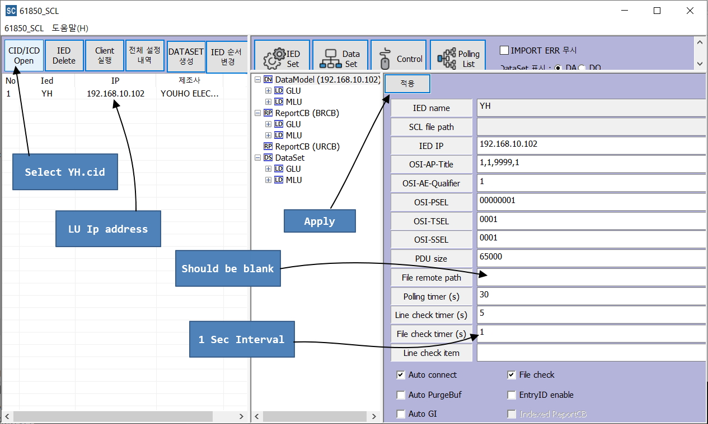

# PDA IEC-61850 References

1. __LU_102_A__ Backup
2. __LU_104_A__ Backup
3. __ClientProc__ executable with SA_Client.ini and YH.cid files Backup
4. __SclManager__ Backup
___
SA_Client.ini has following configs:
```ini
LocalIp=192.168.10.105
...
...
PATH=D:/develop/MZAutomation/SAProgram/ClientProc_2017_Dev_NoTimer_Minsu/ClientProc/61850_CFG/CFG/61850/SA_CFG
SAVE_PATH =D:/develop/MZAutomation/SAProgram/ClientProc_2017_Dev_NoTimer_Minsu/ClientProc/61850_CFG/LOG/61850
ENG_PATH =D:/develop/MZAutomation/SAProgram/ClientProc_2017_Dev_NoTimer_Minsu/ClientProc/61850_CFG/DB/ied_info_gw.csv
```
These configurations should be changed if machine or location is changed. 

It is required to change settings using __SCLManager.exe__ when required for new setup.

<br>

Confluence Pages From PDA
ACQ Operation and calculation / Integration of various current values
Copy of 차단기 동작 특성 페이지
https://jlee193.atlassian.net/wiki/spaces/PDA/pages/514129921/Copy+of

Bushing Documentation Page From PDA 
부싱 누설 전류 페이지
https://jlee193.atlassian.net/wiki/spaces/PDA/pages/296812597

An Initial Concept of hardware pptx file downloaded in Confluence folder
종합예방진단시스템(20210625)_HW팀.pptx
하드웨어 구성
https://jlee193.atlassian.net/wiki/spaces/PDA/pages/154042616

